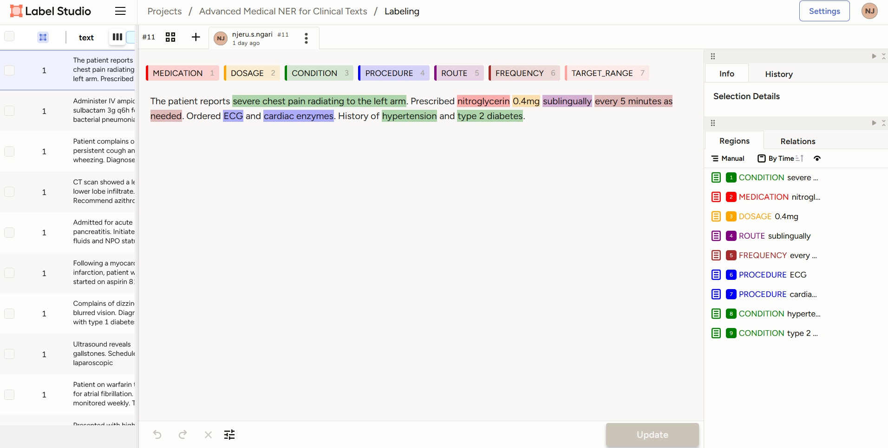

# Advanced Medical NER Annotation Project

## Overview
This project demonstrates my expertise in annotating clinical texts for **Named Entity Recognition (NER)** using **Label Studio**. The annotations were applied to realistic, multi-sentence medical records to create high-quality labeled datasets for training NLP models in healthcare AI applications.

The project involved tagging entities relevant to clinical settings, including medications, dosages, procedures, and more. These datasets can be used for tasks like EHR parsing, diagnostic support, and virtual health assistants.

---

## Entity Labels

The following entity labels were annotated:

- **MEDICATION**: Drug names (e.g., aspirin, salbutamol)
- **DOSAGE**: Complete dosage expressions (e.g., 81mg daily, two puffs)
- **CONDITION**: Diagnoses or symptoms (e.g., hypertension, chest pain)
- **PROCEDURE**: Clinical tests or operations (e.g., CT scan, INR monitoring)
- **ROUTE**: Administration methods (e.g., IV, subcutaneously)
- **FREQUENCY**: Timing (e.g., every 4 hours, once daily)
- **TARGET_RANGE**: Clinical value goals (e.g., INR 2.0 to 3.0)

---

## Tools & Technologies

- **Label Studio**: Open-source annotation tool for multi-label tasks
- **spaCy**: NLP library for NER model training (future integration)
- **JSON/CSV**: Export formats for annotated data

---

### Visual Sample from Label Studio

## Example Annotation

**Text:**
> "Patient on warfarin therapy for atrial fibrillation. INR monitored weekly. Target INR range is 2.0 to 3.0."

**Annotated Entities:**
- **MEDICATION**: warfarin
- **CONDITION**: atrial fibrillation
- **PROCEDURE**: INR
- **FREQUENCY**: weekly
- **TARGET_RANGE**: 2.0 to 3.0

---

## How to Use the Dataset

1. **View Data:** The dataset includes annotated JSON files exported from Label Studio.
2. **Integration:** Use the JSON data to fine-tune NER models in spaCy or similar NLP frameworks.
3. **Training:** Apply this dataset to train models for specific healthcare AI tasks.

---

## File Structure

- `data/advanced_medical_ner.json`: Annotated clinical text in JSON format.
- `examples/`: Sample annotated examples for reference.

---

## Future Work

- **Model Training:** Fine-tune spaCy models using the annotated dataset.
- **Expand Entities:** Add more clinical-specific labels (e.g., LAB_RESULT, SYMPTOM_SEVERITY).
- **Evaluation:** Validate the dataset’s effectiveness in downstream NLP tasks.

---

## Contact
If you're interested in collaborating or using this dataset for healthcare NLP, feel free to reach out via [LinkedIn Profile](https://www.linkedin.com/in/samuel-n-ngari)!
